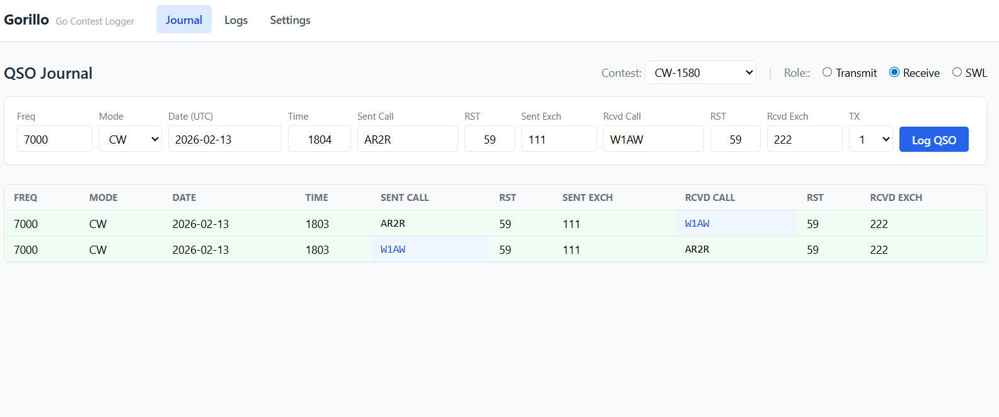
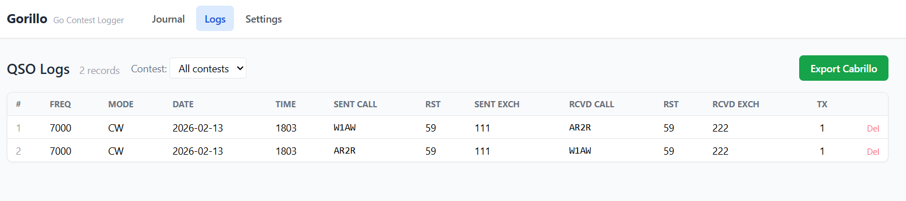
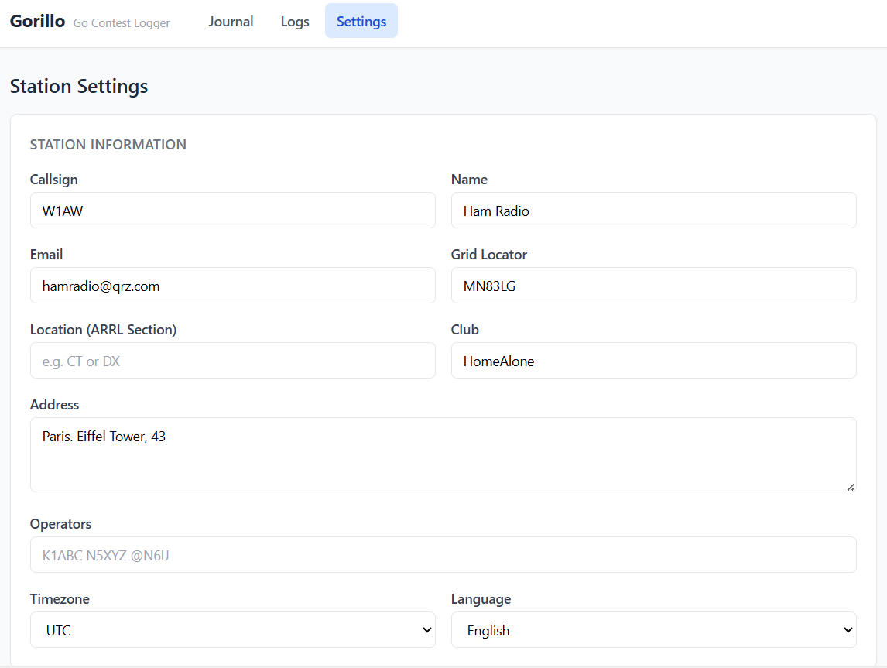
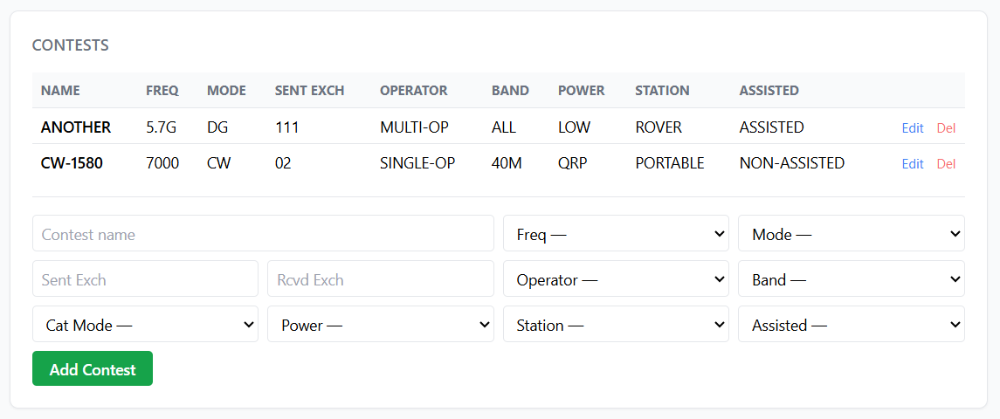

# Gorillo

Gorillo is a lightweight web app for logging amateur radio QSOs, managing contest profiles, and exporting logs in Cabrillo format.

## Why It Is Useful

- Speeds up QSO entry during contests with a compact one-line form.
- Keeps station/operator data in one place for consistent logging and exports.
- Lets you filter logs by contest and export quickly for submission.
- Runs in a browser

## Quick Start

### Local

1. Create `config/config.toml` from `config/config.toml.example`.
2. Start MySQL and create the `gorillo` database.
3. Run:

```bash
go run ./cmd/gorillo
```

4. Open `http://localhost:8000`.

### Docker

```bash
docker compose up --build
```

Then open `http://localhost:8000`.

### Docker Hub Image

Use the published image `minakarthur/gorillo`

```bash
docker pull minakarthur/gorillo
docker run -d --name gorillo -p 8000:8000 minakarthur/gorillo
```

Then open `http://localhost:8000`.

## Screenshots

### Journal



The `Journal` page is built for fast logging from left to right in a single row:
`Freq`, `Mode`, `Date`, `Time`, `Sent/Received Calls`, `RST`, `Exchange`, and `TX ID`.

Example QSO entered via the Journal form:

| Freq | Mode | Date | Time (UTC) | Sent Call | Sent RST | Sent Exch | Rcvd Call | Rcvd RST | Rcvd Exch | TX |
|------|------|------|------------|-----------|----------|-----------|-----------|----------|-----------|----|
| 14000 | CW | 2026-02-13 | 1215 | W1AW | 599 | CT | DL1ABC | 579 | 001 | 0 |

### Logs



The `Logs` page shows all stored QSOs in a table with contest filtering and pagination.

Example QSO table:

| # | Freq | Mode | Date | Time (UTC) | Sent Call | Rcvd Call | Sent Exch | Rcvd Exch | TX |
|---|------|------|------|------------|-----------|-----------|-----------|-----------|----|
| 101 | 14000 | CW | 2026-02-13 | 1215 | W1AW | DL1ABC | CT | 001 | 0 |
| 102 | 7000 | PH | 2026-02-13 | 1220 | W1AW | K3LR | CT | PA | 1 |
| 103 | 21000 | CW | 2026-02-13 | 1228 | W1AW | JA1NUT | CT | 25 | 0 |

### Settings



The `Settings` page stores station identity and operator metadata (callsign, locator, location, club, address, timezone, language) and 

lets you create/edit contest profiles used by Journal and export.

## Example Export (`.cbr`)

Below is a sample Cabrillo contest log

```text
START-OF-LOG: 3.0
CALLSIGN: W1AW
CONTEST: CQ-WW-CW
CATEGORY-ASSISTED: NON-ASSISTED
CATEGORY-BAND: ALL
CATEGORY-MODE: CW
CATEGORY-OPERATOR: SINGLE-OP
CATEGORY-POWER: LOW
CATEGORY-STATION: FIXED
NAME: John Doe
EMAIL: john@example.com
GRID-LOCATOR: FN31
LOCATION: CT
CLUB: Example Radio Club
OPERATORS: W1AW
CREATED-BY: Gorillo v1.0
SOAPBOX:
QSO: 14000 CW 2026-02-13 1215 W1AW         599 CT     DL1ABC        579 001    0
QSO:  7000 PH 2026-02-13 1220 W1AW         59  CT     K3LR          59  PA     1
QSO: 21000 CW 2026-02-13 1228 W1AW         599 CT     JA1NUT        599 25     0
END-OF-LOG:
```

